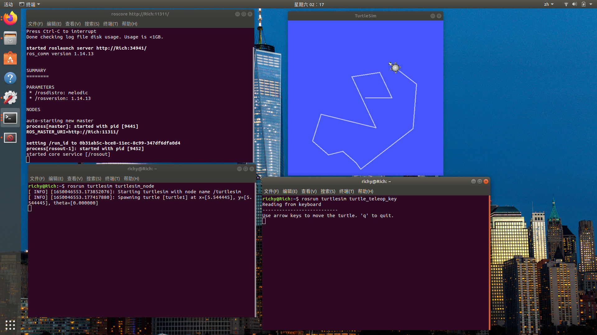
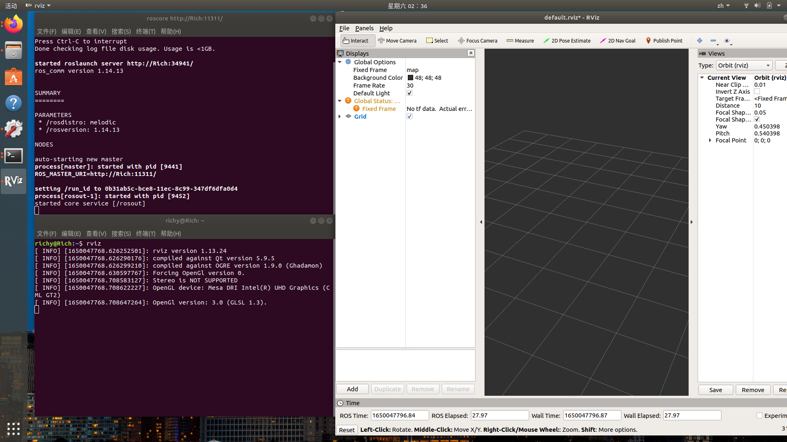
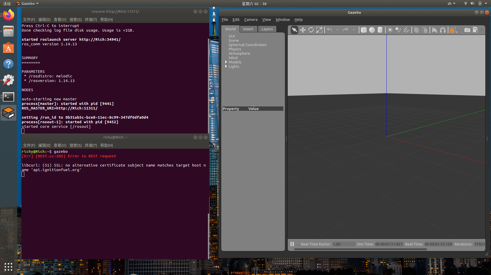

## 海龟测试🐢
启动ROS：`roscore`

打开第二个终端，也可以利用 Ctrl+Shift+T 快捷键打开一个新的终端，运行如下命令：`rosrun turtlesim turtlesim_node`

控制小海龟移动，打开第三个终端，利用Ctrl+Shift+T快捷键再打开一个新的终端，启动turtlesim的键盘控制节点turtle_teleop_key，运行如下命令：
`rosrun turtlesim turtle_teleop_key`

测试结果：

##  启动Rviz

输入： `rviz`

结果：

## 启动Gazebo

输入： `gazebo`

结果：

