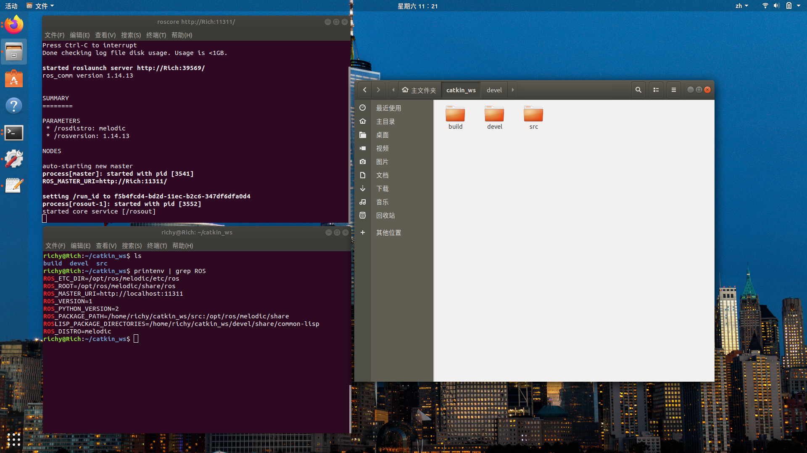
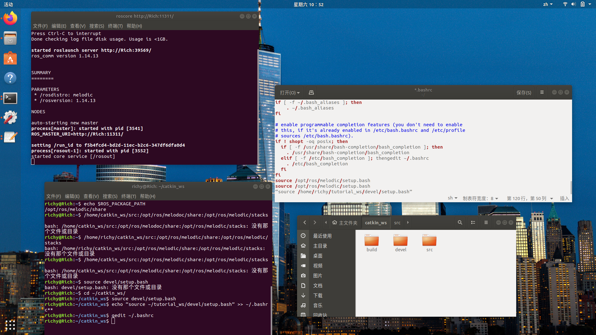

## 创建ROS工作空间

### 1）在home /你的用户名目录下创建一个工作空间，工作空间的名称为catkin_ws，这个名字可以自己任意定义，然后在catkin_ws文件夹下面创建一个src文件

`mkdir -p ~/catkin_ws/src`
****
### 2）进入到catkin_ws下面的src文件夹
`cd ~/catkin_ws/src`
****
### 3）初始化工作空间，执行完该这个命令之后，在src目录下会多出一个 CMakeLists.txt 文件
`catkin_init_workspace`
****
### 4）进入到catkin_ws文件夹下面
`cd ~/catkin_ws/`
****
### 5）catkin_make这个命令执行完会产生build 和 devel者两个文件夹
`catkin_make`
****
### 6）配置工作空间，将对应的路径添加到ROS_PACKAGE_PATH环境变量中
source devel/setup.bash
****
### 7）把 source ~/catkin_ws/devel/setup.bash这条指令加到 ~/.bashrc这个脚本后面
`echo “source ~/tutorial_ws/devel/setup.bash” >> ~/.bashrc**`

'''
其实用gedit ~/.bashrc打开这个文件，然后将source ~/catkin_ws/devel/setup.bash粘贴进去结果是一样的。这样就不用每次source了，在每次打开终端时，让系统自动刷新工作空间环境。在这个工作空间下的所有package都可以编译后就可以直接运行了。
'''

**配置情况：**

