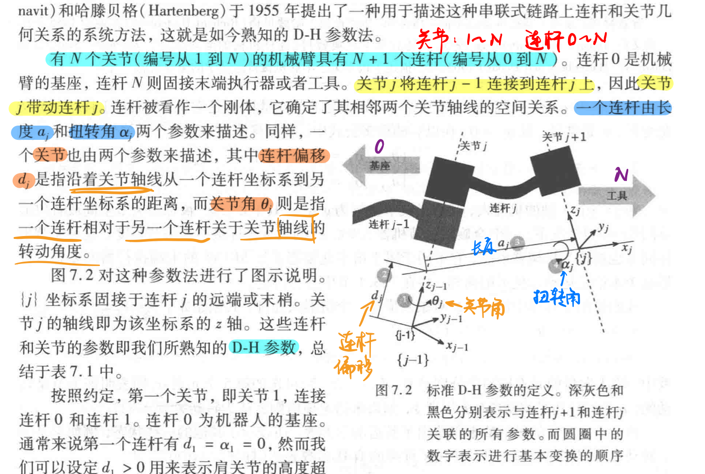
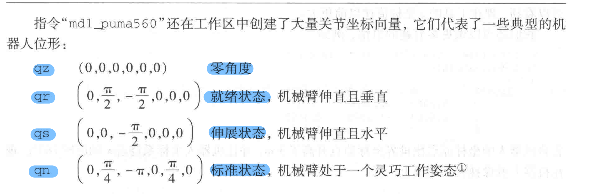
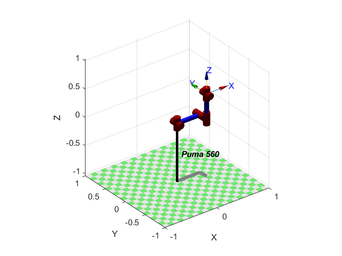

## 第七章 机器人运动学

### 7.1 描述一台机械臂

通过D-H参数法描述串联式链路上连杆和关节几何关系

D-H参数及其含义

### 7.2 正运动学

创建一个名为_p560_的SerialLink对象

`mdl_puma560`

绘图

`p560.plot(qz)`

位姿转换

`p560.base=transl(0,0,3)*trotx(pi)`
`p560.fkine(qz)`

### 7.3 逆运动学
